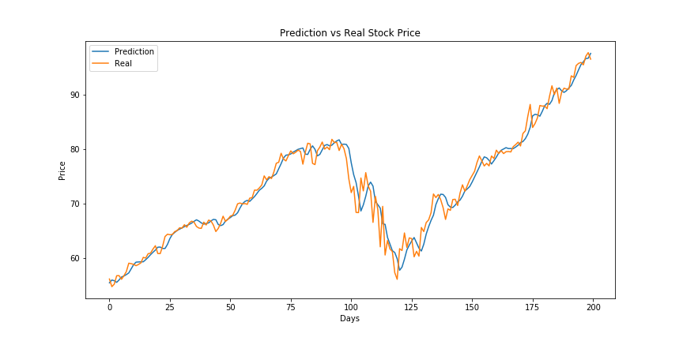
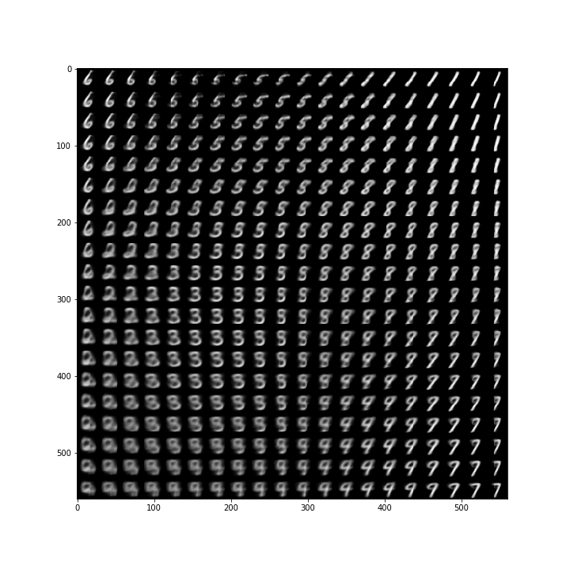
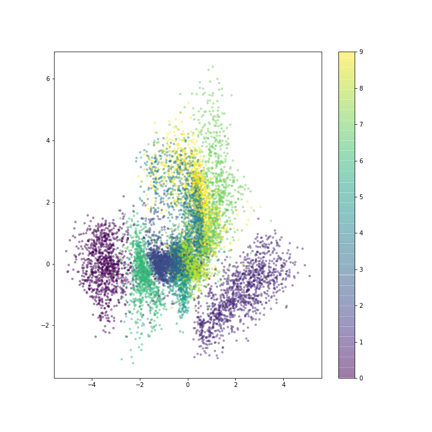

# Data Science Projects

This repository contains a list of data science projects I worked on for academic and self learning purposes. The projects are either written in R or Python. 

Tools:

- **Python**: Numpy, Pandas, Matplotlib
- **Machine Learning**: Scikit-learn, Tensorflow, Keras

Please connect me on [LinkedIn](https://www.linkedin.com/in/weijia-zhang-0417/) if you are looking to hire a data scientist.

## Projects

- [Predicting Stock Price for Apple Company](https://github.com/weijiazzz/data-science/blob/master/stock_price/stock_price_prediction.ipynb): Using long-short term memory (LSTM) to predict future stock prices for Apple company using it's historical data

---

-[Reconstructing Digits Using a Variational Autoencoder](https://github.com/weijiazzz/data-science/blob/master/digits_reconstruction/digits_reconstuction.ipynb): Using variational
autoencoder to draw characteristics from MNIST dataset and reconstruct digits
 | 

---
