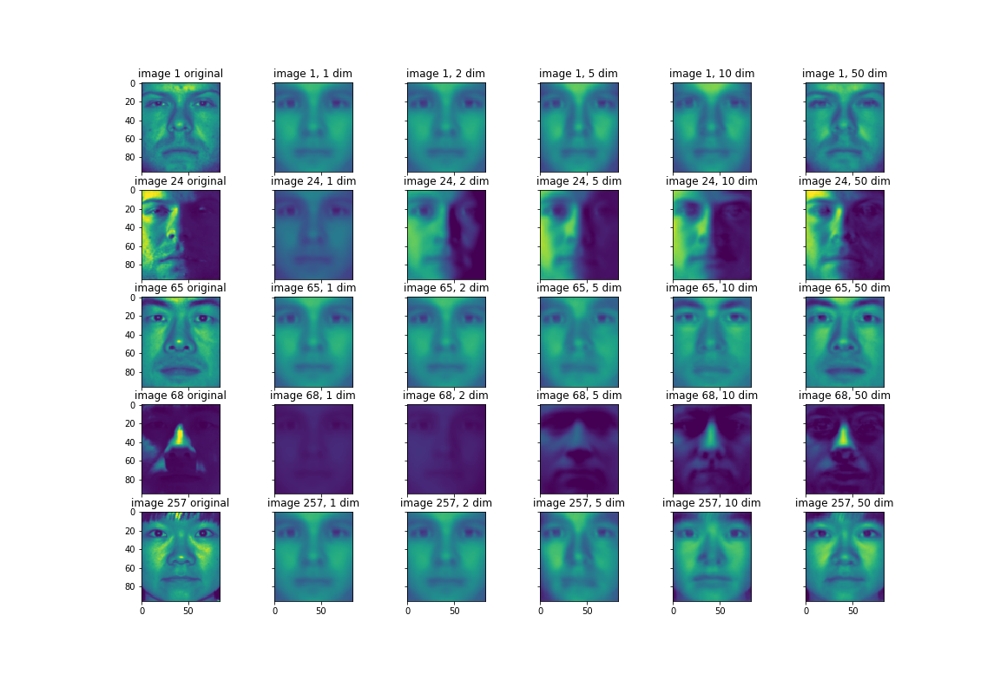

# Data Science Projects

This repository contains a list of data science projects I worked on for academic and self learning purposes. The projects are either written in R or Python. 

Tools:

- **Python**: Numpy, Pandas, Matplotlib
- **Machine Learning**: Scikit-learn, Tensorflow, Keras

Please connect me on [LinkedIn](https://www.linkedin.com/in/weijia-zhang-0417/) if you are looking to hire a data scientist.

## Projects

- [Collaborative Filtering using a Trust Social Network with Deep Learning for Initialization](https://github.com/weijiazzz/data-science/blob/project/cf/collaborative_filtering/cf_with_trust.pdf): Developed a Recommender System algorithm that utilizes a trust social network. Community detection was leveraged on the social network to detect groups of users with shared interests. Deep learning was used to search for a better initialization in the non-convex optimization problem. Experimental results on the [Epinion](https://www.cse.msu.edu/~tangjili/datasetcode/truststudy.htm) dataset were demonstrated.

---

- [Predicting Stock Price for Apple Company](https://github.com/weijiazzz/data-science/blob/master/stock_price/stock_price_prediction.ipynb): Employed a long-short term memory (LSTM) network to predict future stock prices for Apple company using its historical data

---

- [Reconstructing Digits Using a Variational Autoencoder](https://github.com/weijiazzz/data-science/blob/master/digits_reconstruction/digits_reconstuction.ipynb): Developed a variational autoencoder to draw characteristics from MNIST dataset and reconstruct digits

 

- [Reconstructing Faces Using PCA](https://github.com/weijiazzz/data-science/blob/project/pca/faces_reconstruction/faces_reconstruction.ipynb): Reconstruced faces under different lighting conditions using principle component analysis

